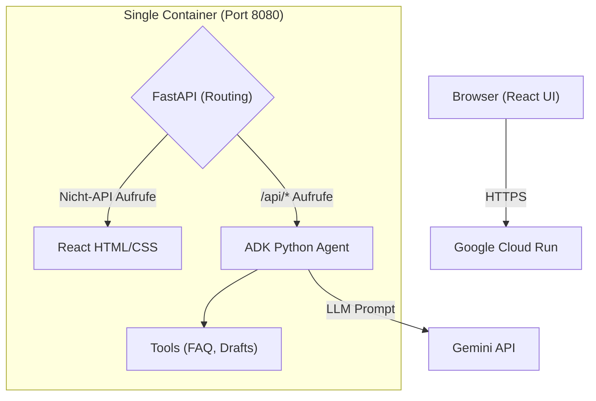
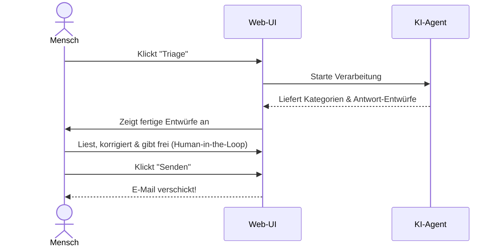
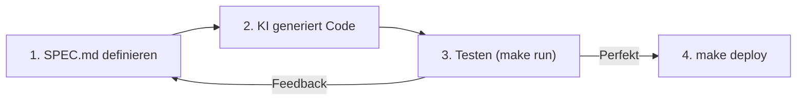

# Email Assistant: Diagramme

Diese Diagramme visualisieren die essenziellen Konzepte des Projekts extrem spartanisch und auf das absolute Minimum reduziert.

## 1. Architektur & Design (Single Container)
Zeigt, wie das React-Frontend und der KI-Agent in einem einzigen Container zusammenarbeiten.

## 2. End-User Workflow (Human-in-the-Loop)
Zeigt, wie der menschliche Nutzer und die KI bei der E-Mail-Bearbeitung interagieren.

## 3. Vibe Coding Workflow
Der Entwicklungs-Zyklus, mit dem dieses Projekt komplett durch natürliche Sprache gesteuert wurde.

